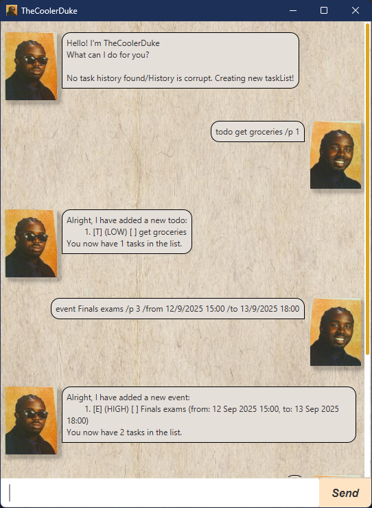

# TheCoolerDuke User Guide



# What is it?
Imagine the usual Duke bot, but better. Need I say more?

- [Quick Start]()
- [Features](#features)
  - [Adding Tasks](#adding-tasks)
    - [General Template](#general-template)
    - [Todos](#adding-todos)
    - [Deadlines](#adding-deadlines)
    - [Events](#adding-events)
  - [Marking Tasks](#marking-tasks)
  - [Unmarking Tasks](#unmarking-tasks)
---
# Quick start

1. Ensure you have Java `17` or above installed in your Computer.<br>
   **Mac users:** Ensure you have the precise JDK version prescribed [here](https://se-education.org/guides/tutorials/javaInstallationMac.html).

2. Download the latest `.jar` file from [here](https://github.com/se-edu/addressbook-level3/releases).
---

# Features

> [!TIP]
> For commands using dates (in the format `DD/MM/YYYY HH:MM`), the leading digit for `DD` and `MM` can be omitted.
> Eg. `3/2/2025 15:00` is still valid, and translates to `3 Feb 2025 15:00`

## Adding Tasks
There are 3 types of tasks that you can track: Todos, Deadlines and Events

### General Template
`{TASK_TYPE} {TASK_NAME} /p {PRIORITY} ...`
- `TASK_TYPE` is either `todo`, `deadline` or `event`.
- `TASK_NAME` is the name of your task.
- `PRIORITY` determines the ordering of your tasklist. It ranges from `1`-`3`
  - `1` --> Highest Priority
  - `2` --> Medium Priority
  - `3` --> Lowest Priority

### Adding Todos
**Command:**`todo {TASKNAME} /p {PRIORITY}`

**Example**: `todo Buy Groceries /p 3`

A Todo task called `Buy Groceries` will be added to your task list with priority `3` (Lowest)

**Expected Output:**
```
Alright, I have added a new todo:
    1. [T] (LOW) [] Buy Groceries
You now have 1 tasks in the list.
```
### Adding Deadlines
**Command:**`deadline {TASKNAME} /p {PRIORITY} /by DD/MM/YYYY HH:MM`

**Example**: `deadline Assignment 1 /p 1 /by 12/09/2025 18:00`

A Deadline task called `Assignment 1` will be added to your task list with priority `1` (Highest)

**Expected Output:**
```
Alright, I have added a new deadline:
    1. [D] (HIGH) [] Assignment 1 (by: 12 Sep 2025 18:00)
You now have 1 tasks in the list.
```

### Adding Events
**Command:**`event {TASKNAME} /p {PRIORITY} /from DD/MM/YYYY HH:MM /to DD/MM/YYYY HH:MM`

**Example**: `event Wedding /p 1 /from 13/10/2025 15:00 /to 13/10/2025 21:00`

An Event task called `Wedding` will be added to your task list with priority `1` (Highest). 
It will be from `13 Oct 2025 15:00` to `13 Oct 2025 21:00`

**Expected Output:**
```
Alright, I have added a new event:
    1. [E] (HIGH) [] Wedding (from: 13 Oct 2025 15:00, to: 13 Oct 2025 21:00)
You now have 1 tasks in the list.
```

## Marking Tasks
**Command:** `mark {INDEX}`

**Example:** `mark 1`

The task currently at index `1` in the task list will be marked as "Done". 
The state of the task will change from `[ ]` to `[X]` 

**Expected Output:**
- If a task exists in the list
```
Ok, I've marked this task as done:
    1. [T] (LOW) [X] Buy Groceries
```
- If the index inputted is out of range/task list is empty
```
The task at this index does not exist!
```

## Unmarking Tasks
**Command:** `unmark {INDEX}`

**Example:** `unmark 1`

The task currently at index `1` in the task list will be marked as "Not Done".
The state of the task will change from `[X]` to `[ ]`

**Expected Output:**
- If a task exists in the list
```
Ok, I've marked this task as done:
    1. [T] (LOW) [X] Buy Groceries
```
- If the index inputted is out of range/task list is empty
```
The task at this index does not exist!
```

## Deleting Tasks
**Command:** `delete {INDEX}`

**Example:** `delete 1`

The task currently at index `1` in the task list will be deleted.

**Expected Output:**
- If a task at the `INDEX` exists in the list
```
Alright, I've removed this task:
    1. [T] (LOW) [X] Buy Groceries
You now have 0 tasks in this list.
```
- If the `INDEX` inputted is out of range/task list is empty
```
The task at this index does not exist!
```

## Saving Data
Task data is automatically saved in the hard disk after every command is run. There is no need to save manually.

## Editing the Data File
All task data is stored in the `TaskHistory.txt` file.
This file is located in `[JAR  File Location]/src/data/TaskHistory.txt`
Advanced users are welcome to update their task data directly from the file!

> [!WARNING] 
> If your changes to the data file makes its format invalid,  **All data in the data file will be discarded** and replaced
> with an empty data file at the next run. Hence, it is recommended to make a backup of the file before editing it.
Furthermore, certain edits can cause the app to behave in unexpected ways 
> (e.g., if a value entered is outside the acceptable range). 
> Therefore, **edit the data file only if you are confident that you can update it correctly.**